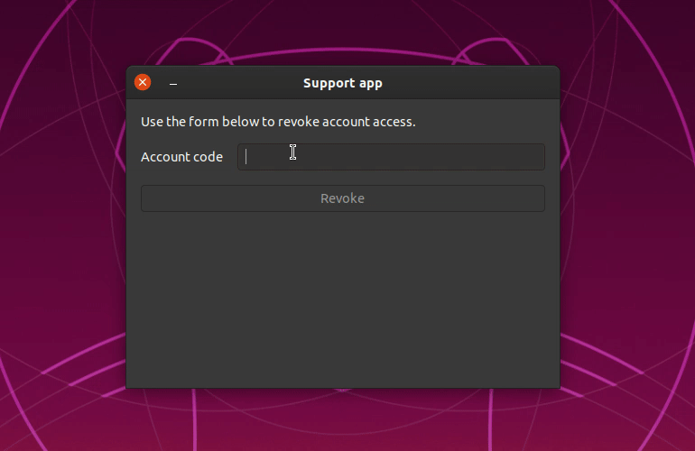
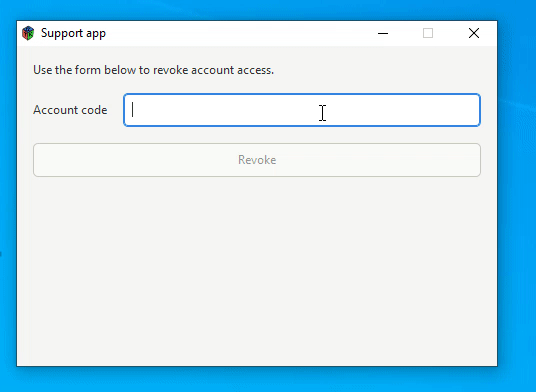

# POC: Rust GTK 3

It demonstrates how to create a native cross-platform desktop application using Rust and GTK 3.

It contains basic UI elements, UI style, event handling and database communication.

## How to run

| Description | Command |
| :--- | :--- |
| Run for development | `make run` |
| Generate the binary | `make build` |
| Provision the database | `make database` |

## Preview

### Linux

### Windows

